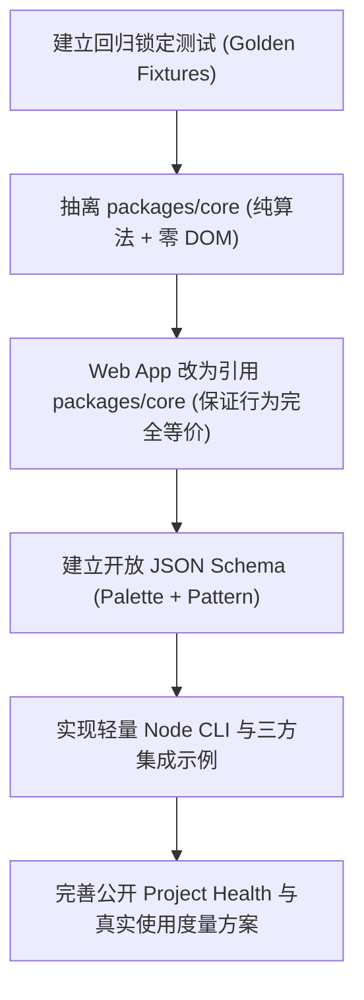

# Bead Grid Studio 开源项目差距分析与升级路线报告
# OPEN_SOURCE_GAP_ANALYSIS.md

**评估基准时间**：2026-09-19  
**仓库地址**：https://github.com/zwhy149/bead-grid-studio  
**当前版本**：v1.1.3 (commit 55fea11)  
**分析角色**：高级开源维护者 / 软件架构师 / 增长与 DevEx 工程师  

---

## 1. 当前项目核心优势

1. **出色的图像离散化与色板匹配算法质量**：
   - 区别于简单的最近邻采样或单一 sRGB 欧氏距离，算法采用 **OKLab 粗筛 + CIEDE2000 高精度色彩距离**。
   - 具备自适应 Otsu 阈值与边界连通背景消除，区分主体内白色与外围透明白底。
   - 针对 60 格以下小尺寸线稿，拥有基于连通组件所有权（Component Ownership）的细化骨架算法，能有效防止墨线粘连、笔画漂移或小部件（如眼睛、鼻点）丢失。
2. **坚定的本地优先（Local-First）与隐私保护设计**：
   - 零图片上传、零后端依赖、零侵入式追踪 SDK，所有解码与转换完全在用户本地浏览器完成。
   - 具备完整的离线可用性，提供单文件便携 HTML（~400KB）与 PWA 离线运行能力。
3. **工程规范与交付质量扎实**：
   - 具备原生 Node 测试套件（`node --test`）、Playwright 跨端（桌面/移动 Chromium）E2E 测试。
   - 色板数据具备严格的来源追溯与 SHA-256 校验机制（`scripts/check-palette.mjs`）。
   - Release 自动化流水线完善，自动打包便携单 HTML、ZIP 与 SHA256 校验和文件。

---

## 2. Meaningful Usage（真实使用）的证据缺口

虽然项目拥有真实的使用与关注数据，但目前在“证据链”和“公开可信度”上存在明显缺口：

1. **公开指标未自动化整合展示**：
   - 仓库实际已有公开数据（2026-09-19 实时数据）：**175 Stars、19 Forks、7 个已发布 Release、累计 156 次 Release 资产下载**。
   - 但这些数据分散在 GitHub 各处，首页 README 中只展示了静态 Release 徽标，没有统一、自动化的 Project Health 状态报告与下载数据汇总。
2. **本地优先特性的“测量困境”被误解**：
   - 因为坚持 Local-First，服务端没有传统 SaaS 的 UV/MAU 漏斗日志。
   - 项目过去未正式阐明“隐私友好型聚合度量（Privacy-Preserving Aggregate Usage Metrics）”的设计路线，容易让外部评估者误以为“项目没有使用数据”。
3. **缺乏社区真实作品沉淀渠道（Showcase Gap）**：
   - 缺乏专门的 Showcase Issue 模板与作品展示画廊，普通创作者在制作实物拼豆后没有结构化的反馈途径，导致“真实实体产出证据”流失在个人社交圈，未能回流开源仓库。

---

## 3. Broad Adoption（广泛采用）的阻碍

1. **定位过于狭窄（The "Bead Only" Framing）**：
   - 项目名称与文档将核心能力限定在“拼豆图纸生成器”。事实上，底层的网格量化、色板约束映射、像素画预处理、微型马赛克和十字绣图纸等手工艺领域具有完全相同的计算需求。
2. **缺乏命令行（CLI）与自动化批处理入口**：
   - 当前完全依赖 Web 交互界面。创作者如果想批量处理 50 张头像生成拼豆图纸，必须手动逐张上传、点击、导出，无法与外部脚本或工作流集成。
3. **首屏认知转化时间较长**：
   - README 虽有火箭对比图，但技术参数和开发说明占比过早，普通手工用户和外部开发者在 15 秒内难以一站式获取“在线体验、离线下载、API 调用、开放数据格式”的清晰矩阵。

---

## 4. Ecosystem Importance（生态重要性）的阻碍

1. **单体应用结构（Monolithic Application Syndrome）**：
   - 核心量化算法 `convertPixels` 被硬编码在 `src/app.js`（3,674 行）中，并通过 Web Worker 的 `convertPixels.toString()` 进行动态序列化调用。
   - 外部开源项目无法通过 `npm install` 直接引入纯算法层，导致该算法只能服务于这一个 Web 页面。
2. **缺乏开放数据规范（Open Data Protocols）**：
   - 色板（Palette）与图纸（Pattern）仅有项目内部的临时 JSON 结构，缺少标准的 JSON Schema 规范定义与版本控制。
   - 其他拼豆软件、像素画工具无法与 Bead Grid Studio 实现双向无缝数据互通。
3. **缺乏公开且可复现的基准测试（Benchmark Suite）**：
   - 没有针对不同分辨率、不同色彩分布、不同硬件环境的算法吞吐量、内存消耗与输出确定性基准，第三方技术选型缺乏量化参考。

---

## 5. 具有通用生态价值的核心能力

经过对源码的深度审计，以下能力具有高度独立的通用开源价值：

| 模块能力 | 源码位置 | 通用场景与复用价值 |
| --- | --- | --- |
| **网格长边与底板几何引擎** (`Geometry`) | `src/core/geometry.js` | 像素画缩放、自适应物理底板留白计算、比例锁定与裁剪代价评估 |
| **感知色彩距离与匹配** (`Color`) | `src/app.js` (633-684) | OKLab 快速聚类筛选 + CIEDE2000 精准色差匹配，中性色防色偏保护 |
| **自适应主体与线稿保护量化** (`Quantize`) | `src/app.js` (1640-2393) | Otsu 自适应暗度阈值、边界背景提取、小尺寸连通组件所有权骨架细化 |
| **用料预算与色彩合并算法** (`Material Budgeting`) | `src/app.js` (2304-2390) | 重要性加权色彩凝聚合并，在保留关键锚点色前提下压低物料种类 |
| **开放色板提供器协议** (`Palette Protocol`) | `src/palettes/catalog.js` | 跨品牌色板定义、色号校验、实体颜色与别名映射 |
| **结构化图纸序列化** (`Pattern Exchange Format`) | `src/app.js` (2848-2855) | 跨软件图纸导入导出、施工单打印渲染与物料清单生成 |

---

## 6. 独立 Package 架构规划（packages/core）

抽离后的结构规划：

```
packages/core/
├── package.json               # 纯核心包元数据，无 DOM/UI 依赖
├── tsconfig.json
├── index.d.ts                 # 完整 TypeScript 类型定义
├── src/
│   ├── index.js               # 核心公开入口
│   ├── geometry.js            # 网格几何与物理底板计算
│   ├── color.js               # 色彩转换 (sRGB, OKLab, CIELAB, CIEDE2000)
│   ├── palette.js             # 色板加载、校验与管理
│   ├── quantize.js            # 核心离散化量化引擎 (convertPixels 逻辑解耦)
│   ├── pattern.js             # 图案数据模型、统计与格式交换
│   └── analysis.js            # 图像复杂度与类型特征分析 (纯像素缓冲)
├── README.md                  # 核心引擎开发者使用指南
└── tests/                     # 针对 Node.js 环境的纯单元与确定性测试
```

---

## 7. 当前是否过度依赖 DOM/UI

**审计结论：核心算法本质纯净，但物理打包与工程边界与 UI 高度耦合。**

- **纯逻辑部分**：`convertPixels` 的入参为 `{ data, width, height, cols, rows, palette, maxColors, ... }`，其中 `data` 为普通一维像素数组，内部完全没有使用 `document`、`window`、`CanvasRenderingContext2D`。
- **耦合部分**：
  1. `convertPixels` 嵌套在 `src/app.js` 的闭包作用域中。
  2. 运行时依赖浏览器 Web Worker 的 `new Blob([source])` 字符串拼接注入。
  3. 色彩计算函数（`hexToRgb`, `rgbToOklab`, `deltaE2000`）在 `src/app.js` 外层与 `convertPixels` 内部各写了一遍，存在代码重复。
  4. 图像分析函数 `analyzeReferenceImage` 直接创建了 `document.createElement('canvas')`，导致无法在纯 Node.js 或无头后端运行。

---

## 8. 外部项目复用现有算法的成本

当前成本：**极高（几乎只能通过 Fork 或复制粘贴代码实现）**
- 必须手动从 3,674 行的 `app.js` 中抽离近 800 行的量化逻辑；
- 必须自行补齐 `rgbLab`、`deltaE2000` 和色板预处理；
- 缺乏独立的 npm 依赖包与 TS 类型定义；
- 没有 Node 环境下的图像缓冲处理示例。

升级后成本：**极低（现代标准模块引入）**
```js
import { generateBeadPattern, getPaletteProvider } from '@bead-grid/core';
const pattern = generateBeadPattern(rawPixelBuffer, { width, height, cols: 48, rows: 48 });
```

---

## 9. 为什么当前项目更像 Application 而非 Reusable Component

1. 根目录 `package.json` 为 `"private": true`，没有声明 `exports` 字段。
2. 缺乏独立的子模块 `packages/core` 与发布流程。
3. 仓库文档 90% 集中于“网页怎么点击使用”，缺少面向二次开发者的“API 架构与数据协议”指南。
4. 没有独立的 CLI 工具，无法作为外部流水线的一个环节调用。

---

## 10. 最低风险平滑升级方案（三层渐进式演进）

为确保 **现有 Web App、PWA、离线单文件 HTML、现有测试与导出功能 100% 零破坏、零退化**，采用“测试先行 -> 核心提炼 -> 内部重合 -> 外部暴露”的闭环步骤：



---

## 11. 任务分级与优先级排序

### P0：高收益、低风险，必须立即落地（本次全部交付）
- **P0-1**：建立高精度回归锁定测试（Golden Fixture Regression Tests），确保图像转换结果像素级确定性不变。
- **P0-2**：抽离 `packages/core` 纯逻辑引擎（Geometry, Color, Quantize, Palette, Pattern），完全脱离 DOM。
- **P0-3**：重构 `src/app.js` 统一引用 `packages/core`，消除内联重复色彩数学代码与 Web Worker 字符串拼凑。
- **P0-4**：制定与输出标准化 JSON Schema：`schema/palette.schema.json` 与 `schema/pattern.schema.json`。
- **P0-5**：创建 Node.js 命令行工具（CLI）与零依赖集成样例（`examples/node-cli`、`examples/custom-palette` 等）。
- **P0-6**：编写 `scripts/project-health.mjs`，自动采集并生成真实可验证的 `project-health.json` 与 `docs/project-health.md`。
- **P0-7**：升级中英文 `README` 首屏结构，突出“开源引擎 + 应用”，清晰列出使用路径与真实采用数据。
- **P0-8**：建立真实可复现的性能基准测试（`benchmarks/`、`npm run benchmark`、`docs/benchmark.md`）。

### P1：明显增加生态价值（本次全部交付）
- **P1-1**：制定隐私友好型聚合度量规范（`docs/USAGE_METRICS.md`），阐明本地优先下的度量哲学。
- **P1-2**：撰写完整的第三方开发者指南（`docs/developer-guide.md`、`docs/palette-format.md`、`docs/pattern-format.md`）。
- **P1-3**：完善贡献者指引与 Issue/Showcase 模板（`docs/showcase.md`、`.github/ISSUE_TEMPLATE/showcase.yml`、`GOOD_FIRST_ISSUES.md`）。
- **P1-4**：输出客观详实的开源生态影响报告（`docs/OPEN_SOURCE_IMPACT.md`）与项目申请支持文档（`docs/OPENAI_OSS_APPLICATION_NOTES.md`）。

### P2：长期建设方向（纳入 ROADMAP.md）
- **P2-1**：正式发布 `@bead-grid/core` 到 npm 官方仓库（由维护者择机执行）。
- **P2-2**：针对 WebAssembly (Wasm) 或 SIMD 的超大图批量量化加速模块。
- **P2-3**：社区贡献的跨品牌商用色板合规验证库与第三方插件系统。
