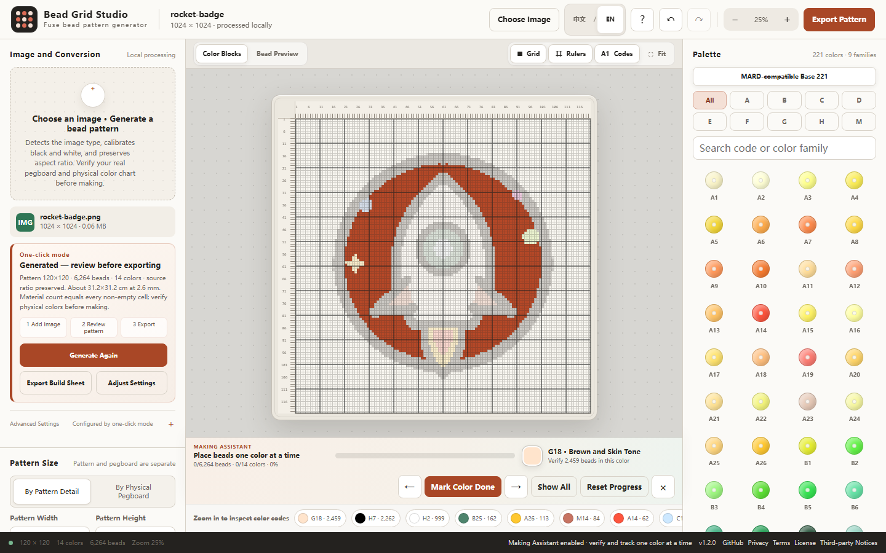
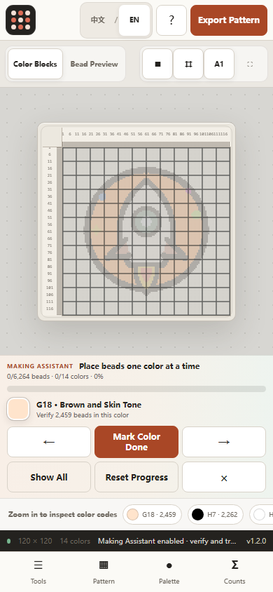

# Bead Grid Studio — Local-first Fuse-bead Pattern Generator

<p align="center">
  <strong>Turn images into editable, printable fuse-bead patterns.</strong><br>
  Color matching, per-cell color codes, board guides, and material counts run locally in your browser.
</p>

<p align="center">
  <a href="README.md"><strong>简体中文</strong></a> · <strong>English</strong>
</p>

<p align="center">
  <a href="https://zwhy149.github.io/bead-grid-studio/?lang=en-US"><strong>🚀 Live Demo</strong></a> ·
  <a href="https://github.com/zwhy149/bead-grid-studio/releases/latest"><strong>⬇ Offline / Release</strong></a> ·
  <a href="#30-second-quick-start"><strong>30s Quick Start</strong></a> ·
  <a href="packages/core/README.md"><strong>💻 Core API (@bead-grid/core)</strong></a> ·
  <a href="schemas/pattern.schema.json"><strong>📐 Schemas</strong></a> ·
  <a href="docs/benchmark.md"><strong>⚡ Benchmarks</strong></a> ·
  <a href="docs/project-health.md"><strong>📊 Project Health</strong></a> ·
  <a href="https://github.com/zwhy149/bead-grid-studio"><strong>⭐ Star on GitHub</strong></a>
</p>

<p align="center">
  <a href="https://github.com/zwhy149/bead-grid-studio/actions/workflows/ci.yml"></a>
  <a href="LICENSE"></a>
  <a href="https://github.com/zwhy149/bead-grid-studio/releases"></a>
  <a href="docs/project-health.md"></a>
  <a href="packages/core/README.md"></a>
</p>

Bead Grid Studio is a **local-first fuse-bead pattern generator**. It has no account, image-upload API, analytics SDK, or cloud conversion service.

## Examples

### Simple Graphic: original → fuse-bead pattern

Both sides use the repository's original rocket fixture. The right side is a screenshot of the real running app, not an AI-generated product mockup.

| Original image | Generated pattern, ready to edit |
| --- | --- |
|  |  |

> Run `npm run capture:docs` to regenerate the screenshot from the same fixture. See [Screenshots](#screenshots) for complete desktop and mobile views.

## What it helps you do

- **Image → bead pattern** for line art, cartoons, photos, document structure, and pixel art.
- **Automatic color matching** with black/white anchors and protection for important accent colors.
- **Editable grid** with brush, eraser, picker, mirror, rotate, undo, and redo.
- **Making-ready details** with per-cell color codes, four-side coordinates, board guides, seams, and material counts.
- **Color-by-color Making Assistant** that isolates one code, advances after completion, and keeps progress locally.
- **Printable and resumable output** as a construction-sheet PNG and editable JSON project.
- **Portable material lists** as UTF-8 CSV with codes, color names, quantities, and completion state.
- **Local-only processing** with no sign-up and no source-image upload.

## 30-second Quick Start

1. Open the [live demo](https://zwhy149.github.io/bead-grid-studio/?lang=en-US).
2. Select **Try a Sample**. You do not need an image to see a real rocket pattern in seconds.
3. Choose a long-side cell count or physical board; keep the recommendation if unsure.
4. Adjust colors or touch up a few cells when needed.
5. Select **Start Making** to place one color at a time, or use **Export Pattern** for a coded build sheet.
6. Export the material CSV and save the JSON project when you need purchasing or progress records.

You can instead select **Choose Image** and use PNG, JPEG, WebP, or GIF. The image is decoded and converted only in the current browser.

## Choose your path

| Goal | Fastest route | Installation |
| --- | --- | --- |
| Convert an image now | [Open the live demo](https://zwhy149.github.io/bead-grid-studio/?lang=en-US) | None |
| Work offline or carry the app on a USB drive | [Download the portable HTML](https://github.com/zwhy149/bead-grid-studio/releases/latest) | None |
| Batch conversion / Headless script automation | [CLI Tool (`bead-grid`)](#command-line-cli--automation) | Node.js |
| Embed conversion engine in Node.js or web app | [@bead-grid/core package](packages/core/README.md) | Node.js |
| Publish your own copy | [Fork and deployment guide](docs/deployment.md) | GitHub account; Cloudflare optional |
| Modify or contribute code | [Developer Guide](docs/developer-guide.md) | Node.js |

## Download the offline app

Regular users do not need the source code or Node.js. The offline app is one self-contained HTML file for modern browsers on Windows, macOS, and Linux:

1. Open the [latest Release](https://github.com/zwhy149/bead-grid-studio/releases/latest).
2. Expand **Assets** near the bottom of the Release page.
3. Download the file named like `bead-grid-studio-vX.Y.Z.html`, where `X.Y.Z` is the version.
4. Do not use GitHub's automatically generated `Source code` ZIP as the offline app.
5. Double-click the HTML and open it with Chrome, Edge, Firefox, or Safari.

The portable HTML embeds the application, styles, Apache-2.0 license, and third-party notices with no CDN dependency. The Release also includes a ZIP and `SHA256SUMS.txt`; compare files only with checksums from the **same Release**:

```powershell
# Windows PowerShell: run from the download directory
Get-FileHash .\bead-grid-studio-vX.Y.Z.html -Algorithm SHA256
Get-Content .\SHA256SUMS.txt
```

```bash
# Linux
sha256sum --check SHA256SUMS.txt

# macOS
shasum -a 256 bead-grid-studio-vX.Y.Z.html
```

On phones, prefer the hosted PWA and use the browser's “Add to Home Screen” action. The PWA must load once from HTTPS before its cached pages can open offline. Drafts live in the current browser's site data; export a JSON project before switching browsers or clearing that data.

## Fork & Make It Yours

A Fork gives a developer a practical starting point to:

- deploy a personal bead-pattern website and URL;
- change the name, branding, and interface;
- add a legally redistributable, verifiable palette;
- improve conversion algorithms and export formats;
- add another language;
- build a dedicated edition for a club, classroom, or studio.

The shortest route is:

```text
Fork → Enable GitHub Actions → Settings → Pages → Deploy
```

The repository already includes its build, complete QA, and Pages workflow; do not commit `dist` manually. Follow the [Fork and deployment guide](docs/deployment.md) to obtain a GitHub Pages URL in a few minutes. The same guide covers Cloudflare Pages when you need a custom domain and security response headers.

## Screenshots

| English desktop workbench | English mobile workbench |
| --- | --- |
|  |  |

The rocket in these screenshots is an original fixture under `tests/fixtures/` and may be reused under this repository's license.

## When the first result needs work

- Pattern too coarse: increase the long-side cell count.
- Subject too small or too much background: crop to one subject first.
- Wide image looks distorted: keep aspect lock enabled; do not force it into a square pattern.
- Too many similar colors: reduce the maximum colors or increase similar-color merging.
- Need to continue later: also save the JSON project. JSON does not embed the reference image, so choose the source again when you need it for comparison.

The project does not promise lossless reproduction at 16 or 24 cells. It protects outlines, openings, and disconnected features when the target grid can represent them, then reports details that are physically smaller than one bead.

## Command-line CLI & Automation

You can generate pattern specifications directly from your terminal or automated scripts:

```bash
# Generate 29x29 standard bead pattern with truecolor ANSI terminal preview
node bin/bead-grid.mjs tests/fixtures/rocket-badge.png -w 29 -h 29 --format ascii

# Quantize using a custom 12-color starter palette and output JSON pattern
node bin/bead-grid.mjs image.png -w 29 -p examples/palettes/mini-starter-12.json -o pattern.json
```

See [CLI Documentation](bin/bead-grid.mjs) and [Node.js Integration Example](examples/node-cli/README.md).

## Developer & Open-source Ecosystem

Bead Grid Studio is not only an end-user Web/PWA application. The repository also provides a complete, reusable open-source stack:

- **DOM-free Quantization Core** (`packages/core/`, `@bead-grid/core`): Runtime-agnostic, zero-dependency ES module executing OKLab and CIEDE2000 color matching identically across Node.js, Web Workers, and Deno. See [Core Documentation](packages/core/README.md).
- **Headless CLI** (`bin/bead-grid.mjs`): Single-command terminal execution for batch conversion with 24-bit ANSI color terminal previews or JSON exports. See [CLI Examples](examples/cli/README.md).
- **Open Pattern & Palette Schemas** (`schemas/`): JSON Schema 2020-12 specifications liberating craft patterns from proprietary file formats. See [Pattern Format Guide](docs/pattern-format.md) and [Palette Format Guide](docs/palette-format.md).
- **Reproducible Benchmark Suite** (`benchmarks/`): Measures quantization latency, memory overhead, and 100% bitwise determinism across 16, 24, 32, 48, and 60 grid dimensions. See [Benchmark Guide](docs/benchmark.md).
- **Ready-to-run Examples** (`examples/`): Standalone examples for Browser, Node.js backend pipelines, and custom brand palettes.

### Architecture Overview

```text
Web / PWA (Browser UI) ──────> Browser Adapter ──┐
Headless CLI (Node.js) ──────────────────────────┼──> @bead-grid/core
Node.js Pipeline / Script ───────────────────────┤     ├── Pattern Model & BOM
Automated Tests / Benchmarks ────────────────────┘     ├── OKLab / CIEDE2000 Matching
                                                       └── Open Schemas (2020-12)
```

For full system architecture diagrams and ASCII data flows, see [ARCHITECTURE.md](ARCHITECTURE.md).

### 5-minute Developer Quick Start

Call the core engine directly in Node.js with zero browser dependencies:

```javascript
import { generateBeadPattern } from './packages/core/src/index.js';

// Pass raw pixel data (data: Uint8ClampedArray/Uint8Array, width, height)
const pattern = await generateBeadPattern(imagePixelData, {
  cols: 29,
  rows: 29,
  palette: 'mard-compatible-base-221',
  processMode: 'cartoon',
  maxColors: 32,
});

console.log(`Total beads: ${pattern.statistics.totalBeads}`);
console.log(`Unique colors: ${pattern.statistics.usedColors}`);
console.log(`Top color code: ${pattern.materials[0].code} (${pattern.materials[0].count} beads)`);
```

Run executable integration examples:
```bash
node examples/node/index.mjs
node bin/bead-grid.mjs tests/fixtures/rocket-badge.png -w 29 -h 29 --format ascii
npm run schema:validate
```

## Run locally for development

Node.js 22.12 or newer is required:

```bash
git clone https://github.com/zwhy149/bead-grid-studio.git
cd bead-grid-studio
npm ci
npm run dev
```

Run test and benchmark suites:

```bash
npm run setup
npm run qa          # Runs source integrity, unit tests, and Playwright E2E
npm run benchmark   # Runs quantization performance benchmarks
npm run health      # Verifies local code health and public metrics
```

See the complete [Developer Guide](docs/developer-guide.md).

## Current Focus & Roadmap

- [x] Extracted `@bead-grid/core` standalone package and headless Node.js CLI.
- [x] Published formal JSON Schemas for color palettes and pattern exchange (JSON Schema 2020-12).
- [x] Implemented reproducible quantization benchmark suite across 16, 24, 32, 48, 60 grids.
- [x] Color-by-color Making Assistant: color isolation, step-by-step progress tracking, local draft recovery, and UTF-8 CSV BOM export.
- [ ] Physical pegboard splitting: automatically slice large murals (>100x100) into 29x29 or 52x52 paginated printable sheets (SVG/PDF).
- [ ] Visual custom palette JSON importer dialog in the web interface.

See [ROADMAP.md](ROADMAP.md) for the full evidence-driven roadmap.

## Community Showcase & Contributing

- 🎨 **Showcase** — Finished a physical bead piece? Share your photos and pattern files in the [Community Showcase](docs/showcase.md)!
- ⭐ **Star** — if Bead Grid Studio saves you time.
- 🐛 **Report a bug** — if a conversion behaves unexpectedly; open an [Issue](https://github.com/zwhy149/bead-grid-studio/issues/new/choose).
- 💡 **Suggest an idea** — if something would improve your workflow; use [Discussions](https://github.com/zwhy149/bead-grid-studio/discussions).
- 🔀 **Fork** — customize palettes, languages, UI, or workflows.
- 💻 **Contribute** — browse [GOOD_FIRST_ISSUES.md](GOOD_FIRST_ISSUES.md) and read [CONTRIBUTING.md](CONTRIBUTING.md).

Verifiable project health data and adoption indicators are documented in [docs/project-health.md](docs/project-health.md) and [docs/USAGE_METRICS.md](docs/USAGE_METRICS.md).

Maintainers can run `npm run metrics` to read Stars, Forks, Open Issues, and real Release asset download counts from GitHub's public API. The script is not included in the web app and never tracks app visitors.

For reproducible project-activity signals, community review records, release safeguards, and explicit evidence boundaries, see [Project health and public impact evidence](docs/project-health.md).

## Main capabilities and engineering boundaries

- Topology-aware refinement for small black-and-white line art.
- Aspect locking, safe auto-trim, contain/cover previews, and manual crop.
- Common 2.6 mm and 5 mm physical-board layouts without non-uniform pattern scaling.
- MARD-compatible base 221-code catalog with pinned provenance; opaque conversion uses 220 solid colors and reserves transparent `H1` for manual editing.
- Construction-sheet PNG with per-cell color codes, coordinates, board guides, seams, and material counts.
- Color focus, per-color progress, draft/project recovery, and UTF-8 material CSV export.
- Responsive Web/PWA, portable single-file HTML, and deterministic regression coverage.

### Why a small grid cannot be “identical”

A grid is an information budget: 16×16 provides only 256 physical positions. A mark, thin letter, or highlight smaller than one cell cannot always remain an independent bead. The converter preserves representable structure and reports missing detail. See [Algorithm](docs/algorithm.md) and [Known limitations](docs/limitations.md).

### Palette and physical color accuracy

The default palette is the base 221-code subset (`A/B/C/D/E/F/G/H/M`) from a pinned MIT-licensed source. Screen HEX values are approximations: displays, room light, printers, manufacturers, and production batches introduce differences. Verify expensive builds against the physical color card for the exact bead brand and batch. See [Palette provenance](docs/palette-provenance.md).

MARD, Artkal, Hama, and Perler are third-party marks. This independent project is not affiliated with or endorsed by those brands. See [TRADEMARKS.md](TRADEMARKS.md).

### Privacy and security

- Images are decoded, converted, and exported locally.
- Project JSON does not embed the reference image or its original filename.
- SVG and HTML image uploads are rejected.
- File, decoded-pixel, project, render, and export sizes are bounded.
- Conversion runs in a cancellable Worker with stale-result rejection.
- The service worker caches only same-origin application resources.

Report security issues privately through [SECURITY.md](SECURITY.md). Do not attach private, customer, or unlicensed images to a public Issue. GitHub Pages does not apply the optional `_headers` file; see [Deployment](docs/deployment.md) for the exact hosting boundary.

## Repository Structure & Architecture

For full system architecture diagrams and ASCII data flows, see [ARCHITECTURE.md](ARCHITECTURE.md).

```text
packages/core/            Decoupled DOM-free core quantization engine & TypeScript definitions
schemas/                  Open data specifications (Pattern & Palette JSON Schema 2020-12)
bin/                      Headless Node.js CLI tool (bead-grid)
examples/                 Browser, Node.js, and CLI integration examples
src/                      Browser app, core modules, i18n, and palette data
public/                   PWA, offline cache, SEO, privacy, and legal pages
tests/unit/               Pure invariant tests & deterministic golden tests
tests/e2e/                Desktop, mobile, and browser tests
tests/fixtures/           Original or explicitly licensed fixtures
scripts/                  Source checks, metrics, and portable build
docs/                     Architecture, algorithm, deployment, provenance, and ADRs
```

## License

Code is licensed under [Apache-2.0](LICENSE). Third-party data and build-tool notices are in [NOTICE](NOTICE). The license permits commercial reuse; it does not grant rights to the Bead Grid Studio name, logo, or third-party marks.

If the project genuinely saves you a manual redraw, consider starring it, sharing it with another maker, or filing a reproducible improvement. Stars never unlock features.
