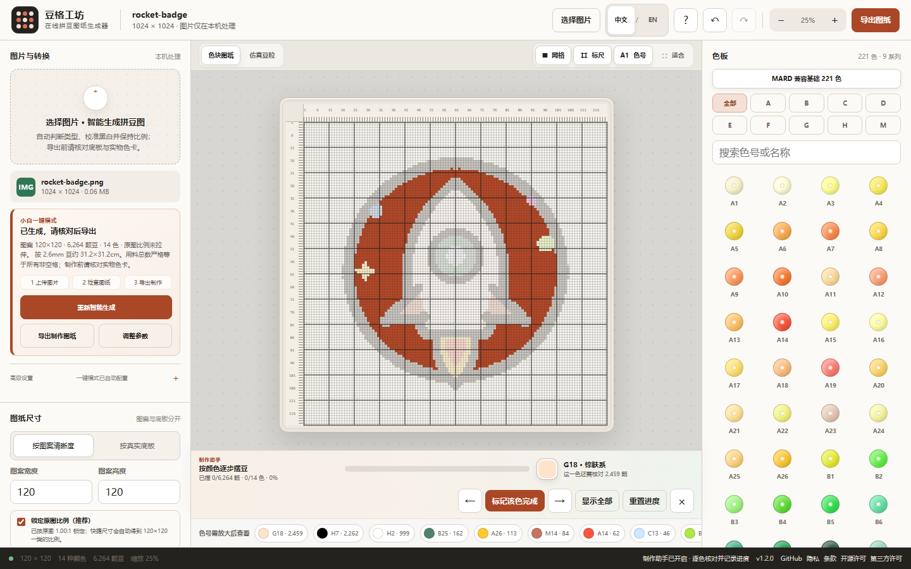
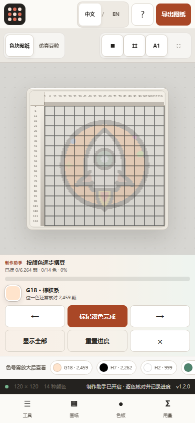

# 拼豆图纸生成器｜豆格工坊（图片转拼豆 / 拼豆像素画）

<p align="center">
  <strong>把图片变成可编辑、可打印的拼豆施工图。</strong><br>
  Bead Grid Studio 支持图片转拼豆、拼豆像素画编辑、自动配色、逐格色号、辅助线与用料统计，全程在你的浏览器本地完成。
</p>

<p align="center">
  <strong>简体中文</strong> · <a href="README.en.md"><strong>English</strong></a>
</p>

<p align="center">
  <a href="https://zwhy149.github.io/bead-grid-studio/?lang=zh-CN"><strong>🚀 在线体验</strong></a> ·
  <a href="https://github.com/zwhy149/bead-grid-studio/releases/latest"><strong>⬇ 离线版 / GitHub Release</strong></a> ·
  <a href="#30-秒快速开始"><strong>30 秒上手</strong></a> ·
  <a href="packages/core/README.md"><strong>💻 开发者核心 (@bead-grid/core)</strong></a> ·
  <a href="schemas/pattern.schema.json"><strong>📐 数据规范 (Schema)</strong></a> ·
  <a href="docs/benchmark.md"><strong>⚡ 基准测试</strong></a> ·
  <a href="docs/project-health.zh-CN.md"><strong>📊 项目健康与指标</strong></a> ·
  <a href="https://github.com/zwhy149/bead-grid-studio"><strong>⭐ GitHub Star</strong></a>
</p>

<p align="center">
  <a href="https://github.com/zwhy149/bead-grid-studio/actions/workflows/ci.yml"></a>
  <a href="LICENSE"></a>
  <a href="https://github.com/zwhy149/bead-grid-studio/releases"></a>
  <a href="docs/project-health.md"></a>
  <a href="packages/core/README.md"></a>
</p>

## 示例 / Examples

### Simple Graphic / 简洁图形：原图 → 拼豆图纸

两侧都使用仓库自有的火箭素材。右侧是应用真实运行后生成的界面截图，不是 AI 绘制的产品假图。

| 原始图片 | 自动生成并可继续编辑的拼豆图纸 |
| --- | --- |
|  |  |

> 截图会由 `npm run capture:docs` 使用同一张火箭素材自动更新。完整的中文桌面与手机截图见[界面预览](#界面预览)。

## 它能帮你完成什么

- **图片 → 拼豆图纸**：适合线稿、卡通、照片、文档结构和像素图。
- **自动配色**：匹配可追溯的拼豆色板，同时保留黑白锚点和重要强调色。
- **可编辑网格**：画笔、橡皮、取色、镜像、旋转、撤销与重做。
- **制作信息齐全**：逐格色号、四边坐标、粗辅助线、底板接缝与用料统计。
- **按色制作助手**：一次突出一个色号，完成后自动切换下一色，并在本地保存制作进度。
- **可打印、可继续编辑**：导出施工图 PNG，并可保存和读取 JSON 工程。
- **材料表可流转**：导出 UTF-8 CSV，包含色号、颜色、数量与完成状态。
- **本地优先**：无需账号、没有图片上传接口、没有统计 SDK；原图像素留在你的设备中。

## 30 秒快速开始

1. 打开[在线版](https://zwhy149.github.io/bead-grid-studio/?lang=zh-CN)。
2. 点击 **试试示例**，不需要先准备图片，几秒钟即可看到真实火箭图纸。
3. 选择图案长边格数或真实底板；不确定时保留自动推荐。
4. 根据需要调整颜色或用画笔修正一两格。
5. 点击 **开始制作**，按颜色逐项摆豆；也可直接点击 **导出图纸** 保存施工图。
6. 需要备料或记录进度时，从用料统计导出 CSV，并保存 JSON 工程。

也可以直接点击 **选择图片**，使用 PNG、JPG、WebP 或 GIF。图片只在当前浏览器内解码和转换。

## 选择适合你的使用方式

| 你想做什么 | 最省事的入口 | 是否需要安装 |
| --- | --- | --- |
| 立即把图片转成拼豆图 | [打开在线版](https://zwhy149.github.io/bead-grid-studio/?lang=zh-CN) | 不需要 |
| 断网使用或保存到 U 盘 | [从 Releases 下载单 HTML](https://github.com/zwhy149/bead-grid-studio/releases/latest) | 不需要 |
| 批量转换 / 终端自动化 | [命令行 CLI 工具 (`bead-grid`)](#命令行-cli-与自动化) | Node.js |
| 在 Node.js / 网页中复用核心能力 | [@bead-grid/core 核心包](packages/core/README.md) | Node.js |
| 部署成自己的公开网页 | [Fork 与部署教程](docs/deployment.zh-CN.md) | 需要 GitHub 账号；Cloudflare 可选 |
| 修改代码或参与开发 | [开发者指南](docs/developer-guide.md) | 需要 Node.js |

## 下载离线版

普通使用者不需要下载源码，也不需要安装 Node.js。离线版是一个完整 HTML 文件，适用于 Windows、macOS 和 Linux 的现代浏览器：

1. 打开[最新 Release](https://github.com/zwhy149/bead-grid-studio/releases/latest)。
2. 展开页面底部的 **Assets**。
3. 下载名字类似 `bead-grid-studio-vX.Y.Z.html` 的文件，其中 `X.Y.Z` 是版本号。
4. 不要把 GitHub 自动生成的 `Source code` ZIP 当作离线应用。
5. 双击 HTML 并选择 Chrome、Edge、Firefox 或 Safari 打开。

单 HTML 已内嵌代码、样式、Apache-2.0 许可证和第三方许可，不依赖外部 CDN。Release 还提供 ZIP 和 `SHA256SUMS.txt`；校验时只与**同一个 Release** 中的文件比较：

```powershell
# Windows PowerShell：先进入下载目录
Get-FileHash .\bead-grid-studio-vX.Y.Z.html -Algorithm SHA256
Get-Content .\SHA256SUMS.txt
```

```bash
# Linux
sha256sum --check SHA256SUMS.txt

# macOS
shasum -a 256 bead-grid-studio-vX.Y.Z.html
```

手机用户优先使用在线 PWA，并通过浏览器“添加到主屏幕”。PWA 必须先在 HTTPS 网页中完整加载一次，之后才能用缓存断网打开。草稿保存在当前浏览器站点数据中；更换浏览器或清理缓存前，请导出 JSON 工程。

## Fork 后做成自己的版本

Fork 不只是复制代码。你可以用它：

- 部署自己的拼豆网站和网址；
- 修改名称、品牌和界面；
- 添加合法、可验证的色板；
- 改进转换算法和导出格式；
- 增加新语言；
- 为社团、教室或工作室制作专用版本。

最短流程：

```text
Fork → 启用 GitHub Actions → Settings → Pages → Deploy
```

仓库已经包含构建、完整 QA 和 Pages 工作流，不需要手工提交 `dist`。按[中文 Fork 与部署教程](docs/deployment.zh-CN.md)操作，通常几分钟即可得到自己的 GitHub Pages 地址；需要自定义域名和安全响应头时，可继续使用同一教程中的 Cloudflare Pages 方案。

## 界面预览

| 中文桌面工作台 | 中文手机工作台 |
| --- | --- |
|  |  |

截图里的火箭位于 `tests/fixtures/`，由仓库自行制作，可按本项目许可证使用。

## 如果第一次结果不理想

- 图案太粗：增加长边格数。
- 主体太小或背景太多：先裁剪单个主体。
- 宽图变得奇怪：保持“锁定原图比例”，不要强制塞进正方形图案。
- 颜色太杂：减少本图最大用色或提高相近色合并。
- 需要下次继续：同时保存 JSON 工程；JSON 不包含参考原图，需要时重新选择原图对照。

本项目不会承诺把任意图片在 16 或 24 格内“无损还原”。它会尽量保护轮廓、开口和彼此分离的小部件；如果细节已经小于一颗豆，会明确提示，而不是静默声称完美。

## 命令行 CLI 与自动化

你可以直接在终端中进行无界面的批量拼豆施工图生成，适用于脚本、流水线与自动化制作：

```bash
# 生成 29x29 标准拼豆施工图并在终端以彩色 ANSI 预览
node bin/bead-grid.mjs tests/fixtures/rocket-badge.png -w 29 -h 29 --format ascii

# 使用极简 12 色入门色板转换并输出 JSON 图纸工程
node bin/bead-grid.mjs image.png -w 29 -p examples/palettes/mini-starter-12.json -o pattern.json
```

详见 [CLI 使用说明](bin/bead-grid.mjs) 与 [Node.js 集成示例](examples/node-cli/README.md)。

## 开发者与开源生态 / Developer & Open-source Ecosystem

Bead Grid Studio 不仅是一个面向最终用户的 Web/PWA 工具，本项目同时提供可独立复用的完整开源技术栈：

- **DOM-free 图像量化核心** (`packages/core/`，`@bead-grid/core`)：0 外部依赖的纯 JavaScript ES Module，可在 Node.js、浏览器 Worker、Deno 等多环境无差异执行 OKLab 与 CIEDE2000 色差量化。详见 [Core 文档](packages/core/README.md)。
- **无头命令行工具** (`bin/bead-grid.mjs`)：终端一行命令完成图像转拼豆施工图，输出 ANSI 24-bit 终端彩色预览或标准 JSON。详见 [CLI 示例](examples/cli/README.md)。
- **开放图纸与色板规范** (`schemas/`)：基于 JSON Schema 2020-12 的版本化数据标准，打破封闭工艺文件格式壁垒。详见 [图纸规范说明](docs/pattern-format.md) 与 [色板规范说明](docs/palette-format.md)。
- **可复现基准测试套件** (`benchmarks/`)：覆盖 16、24、32、48、60 全规格网格，测量量化延迟、内存占用与 100% 位一致性（Determinism）。详见 [性能基准文档](docs/benchmark.md)。
- **开箱即用集成范例** (`examples/`)：包含原生浏览器、Node.js 批处理流水线、CLI 脚本及自定义品牌色板注册。

### 架构一览 / Architecture

```text
Web / PWA (Browser UI) ──────> Browser Adapter ──┐
Headless CLI (Node.js) ──────────────────────────┼──> @bead-grid/core
Node.js Pipeline / Script ───────────────────────┤     ├── Pattern Model & BOM
Automated Tests / Benchmarks ────────────────────┘     ├── OKLab / CIEDE2000 Matching
                                                       └── Open Schemas (2020-12)
```

系统详细架构设计与数据流说明详见 [ARCHITECTURE.md](ARCHITECTURE.md)。

### 5 分钟开发者快速上手 / 5-minute Developer Quick Start

无需浏览器 DOM，直接在 Node.js 中调用核心引擎：

```javascript
import { generateBeadPattern } from './packages/core/src/index.js';

// 传入包含像素 Buffer 的图像对象 (data: Uint8ClampedArray/Uint8Array, width, height)
const pattern = await generateBeadPattern(imagePixelData, {
  cols: 29,
  rows: 29,
  palette: 'mard-compatible-base-221',
  processMode: 'cartoon',
  maxColors: 32,
});

console.log(`总颗粒数: ${pattern.statistics.totalBeads}`);
console.log(`使用色数: ${pattern.statistics.usedColors}`);
console.log(`用料首项: ${pattern.materials[0].code} (${pattern.materials[0].count} 颗)`);
```

运行可执行示例：
```bash
node examples/node/index.mjs
node bin/bead-grid.mjs tests/fixtures/rocket-badge.png -w 29 -h 29 --format ascii
npm run schema:validate
```

## 开发者本地运行

需要 Node.js 22.12 或更高版本：

```bash
git clone https://github.com/zwhy149/bead-grid-studio.git
cd bead-grid-studio
npm ci
npm run dev
```

完整测试与基准测试：

```bash
npm run setup
npm run qa          # 运行代码检查、单元测试与 E2E 测试
npm run benchmark   # 运行量化性能基准测试
npm run health      # 运行项目健康与公开指标检查
```

详见完整的 [开发者指南](docs/developer-guide.md)。

## 当前重点与路线图

- [x] 解耦 `@bead-grid/core` 核心独立包与纯 Node.js CLI 工具。
- [x] 发布开放色板规范与图纸交换 JSON Schema (JSON Schema 2020-12)。
- [x] 建立可复现量化基准套件与性能报告 (`benchmarks/` / `docs/benchmark.md`)。
- [x] 按色制作助手：单色号隔离、逐色完成进度、本地草稿恢复与 UTF-8 CSV 导出。
- [ ] 物理底板分割：大图自动切片为 29x29 / 52x52 物理底板分页打印 (SVG/PDF)。
- [ ] Web 端可视化色板导入：支持拖拽导入自定义 `palette.schema.json`。

完整路线图见 [ROADMAP.md](ROADMAP.md)。

## 社区展示与参与贡献

- 🎨 **作品展示** — 完成了物理拼豆作品？欢迎在 [社区展示区](docs/showcase.md) 分享成品照片与图纸！
- ⭐ **Star** — 如果这个工具帮你节省了时间。
- 🐛 **反馈 Bug** — 如果转换结果出现异常，请提交 [Issue](https://github.com/zwhy149/bead-grid-studio/issues/new/choose)。
- 💡 **提出建议** — 如果你希望增加实用功能，欢迎前往 [Discussions](https://github.com/zwhy149/bead-grid-studio/discussions)。
- 🔀 **Fork** — 定制自己的色板、语言、界面或流程。
- 💻 **参与贡献** — 查看 [GOOD_FIRST_ISSUES.md](GOOD_FIRST_ISSUES.md) 与 [CONTRIBUTING.md](CONTRIBUTING.md)，提交你的 Pull Request。

真实可验证的项目健康数据与公开指标见 [docs/project-health.md](docs/project-health.md) 与 [docs/USAGE_METRICS.md](docs/USAGE_METRICS.md)。

需要核验项目活跃度、社区处理记录、发布安全和公开数据边界时，请查看[项目健康度与公开影响证据](docs/project-health.zh-CN.md)。

## 主要能力与工程边界

- 黑白线稿的小尺寸拓扑精修和分离部件保护。
- 锁定原图比例、安全自动裁边、完整显示/铺满裁切和手动裁剪。
- 常见 2.6 mm、5 mm 实体底板布局；图案在底板内居中，不做非等比拉伸。
- MARD 兼容基础 221 色号及固定来源记录；普通不透明图片量化使用 220 个实色，`H1` 透明色仅供手动画入。
- 带逐格色号、四边坐标、辅助线、接板线和用量统计的拼豆施工图 PNG。
- 按色聚焦、逐色完成进度、工程/草稿恢复和 UTF-8 材料 CSV。
- 响应式 Web/PWA、单 HTML 离线版和确定性回归测试。

### 小网格为什么不可能“一模一样”

豆格数量就是信息容量：16×16 只有 256 个位置，源图中小于一格的鼻点、细字或反光不可能全部独立表示。转换器会保护可表达的结构，并报告无法容纳的细节。详见[算法说明](docs/algorithm.md)和[已知限制](docs/limitations.md)。

### 色号与实物色差

默认色板为固定 MIT 数据源中的基础 221 子集（`A/B/C/D/E/F/G/H/M`）。屏幕 HEX 只能近似表示实物；显示器、环境光、打印、品牌配方和生产批次都会产生差异。大量采购前，请用实际购买品牌与批次的实物色卡复核。完整来源见[色板来源](docs/palette-provenance.md)。

MARD、Artkal、Hama、Perler 等是第三方标识，本项目与这些品牌不存在隶属或官方背书关系。见[商标说明](TRADEMARKS.md)。

### 隐私与安全

- 图片在本地解码、转换和导出。
- JSON 工程不嵌入参考原图或原始文件名。
- SVG/HTML 不能作为图片上传。
- 文件大小、解码像素、工程大小、屏幕像素和导出像素都有上限。
- 转换在可取消 Worker 中运行，并拒绝过期结果覆盖新工程。
- Service Worker 只缓存同源应用资源。

安全问题请按 [SECURITY.md](SECURITY.md) 私下报告。公开 Issue 不要附带隐私图片、客户图片或无权公开的作品。GitHub Pages 不会应用仓库里的可选 `_headers` 文件；具体托管安全边界见[部署说明](docs/deployment.zh-CN.md)。

## 仓库结构与架构

系统详细架构设计与 ASCII 流程图见 [ARCHITECTURE.md](ARCHITECTURE.md)。

```text
packages/core/            解耦的 DOM-free 图像量化核心库与 TypeScript 定义
schemas/                  开放数据规范（图纸与色板 JSON Schema 2020-12）
bin/                      无头 Node.js CLI 工具 (bead-grid)
examples/                 Browser、Node.js 与 CLI 集成范例
src/                      浏览器应用、核心 Module、i18n 和色板数据
public/                   PWA、离线缓存、SEO、隐私与许可页
tests/unit/               纯函数不变量测试与确定性 Golden 测试
tests/e2e/                桌面、移动端和浏览器测试
tests/fixtures/           自制或明确授权的测试图
scripts/                  源码检查、截图、指标和单 HTML 构建
docs/                     架构、算法、部署、色板来源和 ADR
```

## 许可证

代码采用 [Apache-2.0](LICENSE)。第三方数据和构建工具归属见 [NOTICE](NOTICE)。许可证允许商业复用，但不授予“豆格工坊”名称、Logo 或第三方品牌标识的使用权。

如果项目确实帮你省去了一次手工描图，可以 Star 仓库、分享给其他拼豆爱好者，或提交可复现的改进建议。Star 不会解锁任何功能。
