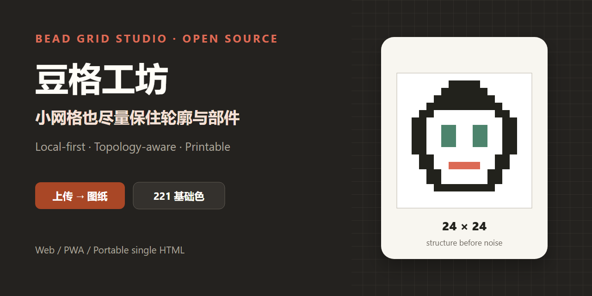
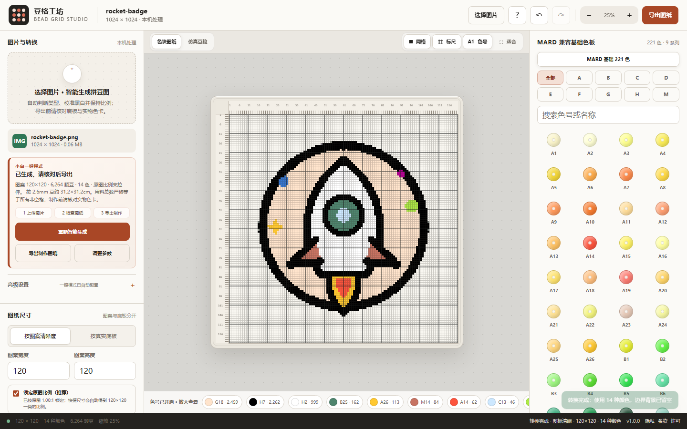
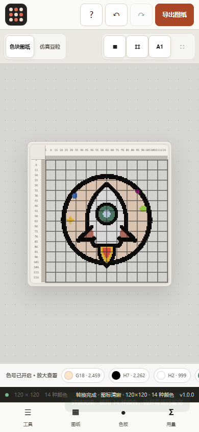

<p align="center">
  
</p>

<p align="center">
  <a href="https://zwhy149.github.io/bead-grid-studio/"><strong>在线体验</strong></a> ·
  <a href="https://github.com/zwhy149/bead-grid-studio/releases/latest"><strong>下载单文件版</strong></a> ·
  <a href="docs/algorithm.md"><strong>算法说明</strong></a> ·
  <a href="README.md"><strong>English</strong></a>
</p>

# 豆格工坊

豆格工坊会在浏览器本机把图片转换为可编辑、可打印并便于实际制作的拼豆图纸，并输出逐格色号、四边坐标、辅助线、底板接缝和用料统计。

它的重点不是凭空“恢复高清”，而是在小网格能够表达的范围内尽量保留轮廓、开口和彼此分离的小部件；如果某个细节已经小于一颗豆，会明确给出诊断，不会静默声称完美还原。

社区版没有图片上传接口、账号、统计 SDK 或云端转换服务，原图像素留在你的浏览器中。

## 为什么要单独做这个项目

一般像素化工具追求远看相似，但能制作的拼豆图纸还必须满足：

- 一个非空格严格对应一颗实体豆；
- 眼睛、嘴点、轮廓和开口不能因为缩小而随意粘连；
- 宽图不能被硬拉成正方形；
- 空底板与白色豆子必须是两种状态；
- 导出统计之和必须等于图纸的非空格数。

豆格工坊把这些当作不变量，而不是视觉偏好。

## 已有能力

- 黑白线稿的小尺寸拓扑精修和分离部件保护。
- 线稿/卡通、高清细节、照片、文档结构和像素直采模式。
- 锁定原图比例、安全自动裁边、完整显示/铺满裁切和手动裁剪。
- 常见 2.6 mm、5 mm 实体底板布局；图案在底板内居中，不做非等比拉伸。
- MARD 兼容基础 221 色号及固定来源记录。
- 画笔、橡皮、取色、镜像、旋转、撤销重做和 JSON 工程文件。
- 带逐格色号、四边坐标、粗辅助线、接板线和用量的施工图 PNG。
- 桌面/手机响应式界面、可安装 PWA 和可下载单 HTML。
- 纯函数单测、桌面/移动端 E2E 和 80 项浏览器内置回归。

## 界面

| 桌面工作台 | 手机工作台 |
| --- | --- |
|  |  |

截图里的火箭是仓库自制测试素材，位于 `tests/fixtures/`，可按本项目许可证使用。

## 一分钟启动

需要 Node.js 22.12 或更高版本。

```bash
git clone https://github.com/zwhy149/bead-grid-studio.git
cd bead-grid-studio
npm install
npx playwright install chromium firefox webkit
npm run dev
```

打开 `http://127.0.0.1:4173/`。普通使用者也可以从最新 Release 下载 `bead-grid-studio-v*.html`，直接双击离线使用。

## 质量门禁

```bash
npm run check       # 源码、色板、PWA 和不变量检查
npm run test:unit   # 比例与底板纯函数测试
npm run build       # 构建 PWA 和单文件版
npm run test:e2e    # 桌面/手机浏览器测试
npm run qa          # 执行全部检查
```

浏览器测试会对生产 `dist` 构建执行 Chromium、Firefox、WebKit 检查，并运行应用内 80 项转换回归。公开 CI 未通过时不应发布 Release。详见[验证报告](docs/verification.md)。

## 60 格以下到底能不能“一模一样”

不能作不真实承诺。豆格数量就是信息容量：16×16 只有 256 个格，源图中小于一格的鼻点、细字或反光不可能全部独立表示。

本项目能做的是：在与目标尺寸无关的中间栅格上分析线稿，用来源连通部件 owner 追踪每个小部件，投影后避免不同部件粘连；在没有冲突时，可以给极小部件强制保留一个支持度最高的格。如果仍无法容纳，界面会提示具体缺失数，并建议升到 24/32/48/60 格或手工修补。

详细规则见 [算法说明](docs/algorithm.md) 和 [已知限制](docs/limitations.md)。

## 仓库结构

```text
src/
  app.js                  浏览器编辑器与稳定转换流程
  core/geometry.js        纯比例/底板几何 Module
  palettes/mard221.js     带来源的 221 色 PaletteCatalog 数据
public/                   PWA、离线缓存、隐私与许可页
tests/
  unit/                   纯函数不变量测试
  e2e/                    桌面与移动端浏览器测试
  fixtures/               自制或明确授权的测试图
scripts/                  源码检查、截图、单 HTML 构建
docs/                     架构、算法、色板来源和 ADR
```

首版没有为了“看起来模块化”而重写已经稳定的算法。当前先抽出了最容易造成畸形的几何 Interface；下一阶段会把转换过程抽成不依赖 DOM 的 `ConversionEngine` 深 Module，并用 Worker/测试两个 Adapter 调用。见 [架构说明](docs/architecture.md)。

## 色号与实物色差

默认色板为固定 MIT 数据源中的基础 221 子集（`A/B/C/D/E/F/G/H/M`）。`H1` 是透明色，不参与普通不透明图片量化；`H2` 是白色锚点；`H7` 是黑色锚点。

屏幕 HEX 只能近似表示实物。显示器、环境光、打印、品牌配方和生产批次都会产生差异。大量采购和正式制作前，请用你实际购买品牌与批次的实物色卡复核。完整来源见 [色板来源](docs/palette-provenance.md)。

MARD、Artkal、Hama、Perler 等是第三方标识，本项目与这些品牌不存在隶属或官方背书关系。见 [商标说明](TRADEMARKS.md)。

## 隐私与安全

- 图片在本地解码、转换和导出。
- JSON 工程不嵌入参考原图。
- SVG/HTML 不能作为图片上传。
- 文件大小、解码像素、工程大小、屏幕像素和导出像素都有上限。
- 转换在可取消 Worker 中运行，并拒绝过期结果覆盖新工程。
- Service Worker 只缓存同源应用资源。

安全问题请按 [SECURITY.md](SECURITY.md) 私下报告。公开 Issue 不要附带隐私图片、客户图片或无权公开的作品。

GitHub Pages 不会应用仓库里的可选 `_headers` 文件；具体托管安全边界见 [部署说明](docs/deployment.md)。

## 贡献

转换质量 Issue 最好包含：原图尺寸、目标格数、模式、预期结构、实际缺陷，以及你有权公开的复现图片。开始前阅读 [CONTRIBUTING.md](CONTRIBUTING.md)。

适合首次贡献的方向：回归测试、翻译、无障碍交互、可核验色板来源、打印模板和小型纯函数抽离。只有在存在可运行 Adapter 和长期维护者时，才增加新的平台目录。

## 多端路线

当前主线是同一套响应式 Web/PWA，并附带单 HTML。它已经覆盖 Windows、macOS、Linux、Android 和 iOS 的现代浏览器，不需要先维护四套空壳应用。

后续顺序是：可测试核心 → 专心制作/进度模式 → 矢量分页导出 → 有真实需求再加 Tauri 桌面 Adapter → 最后才考虑应用商店或微信小程序 Adapter。详见 [ROADMAP.md](ROADMAP.md)。

## 参考与独立实现

[Zippland/perler-beads](https://github.com/Zippland/perler-beads) 证明了本地处理、响应式 PWA 拼豆工具的真实需求。豆格工坊没有复制它的源码、文案、图片、图标或色板文件；界面和转换流程均为独立实现。该参考仓库采用 AGPL-3.0。

## 许可证

代码采用 [Apache-2.0](LICENSE)。第三方数据归属见 [NOTICE](NOTICE)。Apache-2.0 允许商业复用，但不授予“豆格工坊”名称、Logo 或第三方品牌标识的使用权。

豆格工坊依靠可复现的缺陷报告、可再分发测试图、文档、翻译和代码贡献持续改进。如果它帮你省去了一次手工描图，可以 Star 仓库或分享给其他拼豆爱好者；Star 不会解锁任何功能。
