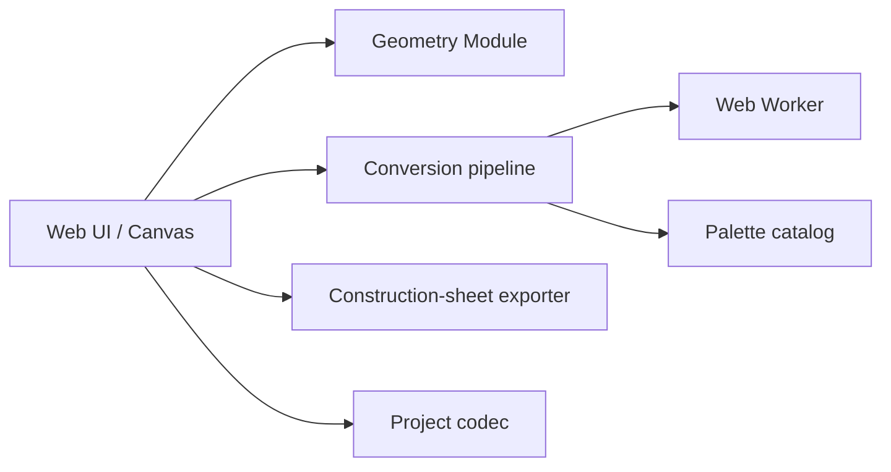

# Architecture

## Current release

The first community release deliberately preserves the conversion Implementation that already passed extensive browser regressions. It extracts the most failure-prone shape logic into a pure geometry Module and adds repeatable browser and unit tests around the application.



The deletion test for `src/core/geometry.js` is clear: removing it forces the UI, physical-board layout, quality warnings, and tests to reimplement the same aspect-ratio decisions. The small Interface therefore has high Leverage and better Locality than duplicated event-handler arithmetic.

## Target Modules

### ConversionEngine

Proposed Interface:

```ts
convert(
  pixels: PixelBuffer,
  options: ConversionOptions,
  palette: Palette,
): ConversionResult
```

The Interface returns cells, selected codes, counts, and diagnostics. The Implementation hides sampling, OKLab/CIEDE2000 matching, line-art component ownership, color limiting, background flood fill, and small-grid refinement. It must not depend on DOM, Canvas, Worker, local storage, or file downloads.

### ConversionRunner Seam

Two real Adapters justify this Seam:

- `WebWorkerRunner`: cancellable, timed, transfer-based browser execution.
- `InlineRunner`: deterministic unit/benchmark execution.

Both Adapters must enforce stale-result rejection and the same result validation.

### PaletteCatalog

Interface: obtain a versioned palette by id, validate a code, and expose provenance. The Implementation owns aliases, transparent-code policy, exact RGB/HEX data, and future palette migrations.

### ProjectCodec

Interface: `parse`, `serialize`, and `migrate`. The Implementation owns schema versions, cell validation, size limits, code allowlists, and atomic replacement rules.

### ProjectWriter Seam

Two browser Adapters already exist conceptually:

- File System Access writer, which can confirm a completed write.
- Download writer, which can only confirm a browser download was started.

The Interface must preserve that distinction rather than reporting both as “saved”.

## Why not Next.js or native shells now

The application is a local static tool. It does not need server rendering, API routes, account middleware, or a Node production runtime. Vite keeps the build and contribution surface small.

A PWA and portable HTML already cover modern desktop and mobile browsers. A Tauri, Capacitor, or mini-program Adapter should be added only when it delivers a tested platform capability that the Web Adapter cannot provide. Empty platform directories reduce Locality and create maintenance claims without user value.

## Refactoring rule

Do not combine a visual rewrite, framework migration, and conversion rewrite in one pull request. First lock current behavior with golden fixtures, then move one cohesive Module while keeping the Interface small. A refactor is complete only when the old Implementation is deleted; parallel duplicate paths are not an architecture improvement.
